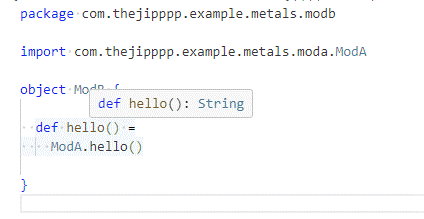

# Broken sourcedeps

## How to use

1. Navigate in to `head-project`
2. Run `sbt update bloopInstall`, will generate bloop files for all projects, also sourcedep.
3. Open VSCode `code .vscode/exampleProject.code-workspace`
  (with OS corrected slashes of course)

## Tested with

```
VSCode 1.84.0
Windows 10
```

## Outcome

### Works in
```
Extension: v1.23.0
Metals version: 0.11.12
```

E.g. type detection just works.




### Broken in

```
Extension: v1.26.0
Metals version: 1.1.0
```

Log output
```
2023.11.03 14:02:11 INFO  no build target found for C:\me\dev\git\opensource\vscode-metals-folder-issue-reproducer\side-project\mod-b\src\main\scala\com\thejipppp\example\metals\modb\ModB.scala. Using presentation compiler with project's scala-library version: 3.3.1
```

E.g. when using `infer type annotation` it produces `Any`.
